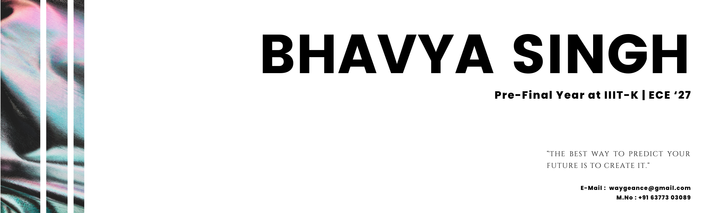

<!-- 🐍 Snake Animation Banner -->

  

<!-- 🚀 Cyberpunk Neon Header -->

  

<!-- Minimal Neon Banner -->

  

<!-- Matrix Glow Divider -->

  

<!-- Waving Hand Greeting -->
<h2 align="center">Hi there! </h2>

---

<!-- Badges -->

   
  
  

<!-- Divider -->

  

<!-- About Me -->
### 👨‍💻 About Me  
- 🌱 Exploring **MERN Stack, Competitive Programming, Digital Wellness Apps**  
- 🎓 Pre-final Year @ **IIIT Kota (ECE)**  
- 🔭 Building: **Gitavani (AI Gita Model)** | **Digital-Detox App** | **NetraX (Accessibility OCR)**  
- 💡 Motto: *“Way of Vengeance → Turning setbacks into comebacks”*  
- ⚡ Fun fact: Automating my **GitHub streaks 🔥**  

---

<!-- Tech Stack -->
### ⚡ Tech Arsenal

  

---

<!-- GitHub Stats -->
### 📊 Stats & Activity  

  
  

---

<!-- Random Quote -->
### ✨ Random Quote  

  

---

<!-- Achievements -->
### 🏆 Trophies  

  

---

<!-- Visitor Counter -->
### 👀 Visitor Count  

  

---

<!-- Contact Me -->
### 🤝 Let’s Connect  

  
  
  
  

---

<!-- Thank You -->
<h3 align="center">✨ Thank you for visiting my profile 🙏 Have a great day! ✨</h3>
